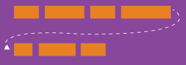
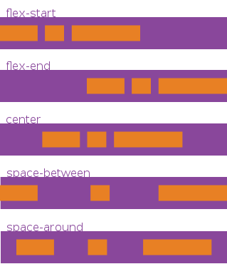
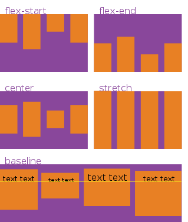
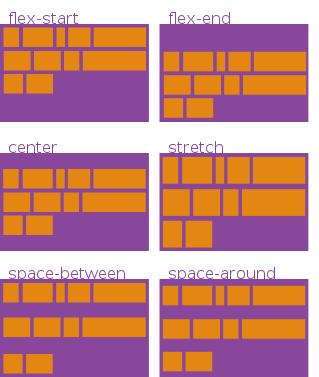
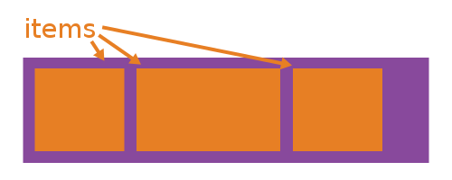
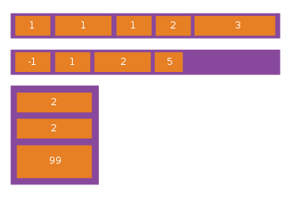
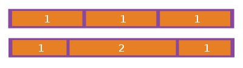
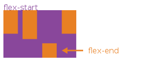

##学习CSS布局

分享人：杨帆
分享时间：2019-06-24

###一. "display"属性
display 是CSS中最重要的用于控制布局的属性。每个元素都有一个默认的 display 值，这与元素的类型有关。对于大多数元素它们的默认值通常是 block 或 inline 。一个 block 元素通常被叫做块级元素。一个 inline 元素通常被叫做行内元素。
####1. block
div 是一个标准的块级元素。一个块级元素会新开始一行并且尽可能撑满容器。其他常用的块级元素包括 p 、 form 和HTML5中的新元素： header 、 footer 、 section 等等。
####2. inline
span 是一个标准的行内元素。一个行内元素可以在段落中 
`<span>像这样</span>` 包裹一些文字而不会打乱段落的布局。
####3. none
另一个常用的display值是 none 。一些特殊元素的默认 display 值是它，例如 script 。 display:none 通常被 JavaScript 用来在不删除元素的情况下隐藏或显示元素。

它和 visibility 属性不一样。把 display 设置成 none 元素不会占据它本来应该显示的空间，但是设置成 visibility: hidden; 还会占据空间。

####4. 其他 display 值
还有很多的更有意思的 display 值，例如 list-item、inline-block 和 flex 。

####5. 额外加分点
每个元素都有一个默认的 display 类型。不过你可以随时随地的重写它！虽然“人为制造”一个行内元素可能看起来很难以理解，不过你可以把有特定语义的元素改成行内元素。常见的例子是：把 li 元素修改成 inline，制作成水平菜单。

###二. "position"属性
position 这个属性定义建立元素布局所用的定位机制。任何元素都可以定位，不过绝对或固定元素会生成一个块级框，而不论该元素本身是什么类型。相对定位元素会相对于它在正常流中的默认位置偏移。
####1. static
static 是默认值。任意 position: static; 的元素不会被特殊的定位。一个 static 元素表示它不会被“positioned”，一个 position 属性被设置为其他值的元素表示它会被“positioned”。
####2. relative
relative 表现的和 static 一样，除非你添加了一些额外的属性。在一个相对定位（position属性的值为relative）的元素上设置 top 、 right 、 bottom 和 left 属性会使其偏离其正常位置。其他的元素的位置则不会受该元素的影响发生位置改变来弥补它偏离后剩下的空隙。
####3. fixed
一个固定定位（position属性的值为fixed）元素会相对于视窗来定位，这意味着即便页面滚动，它还是会停留在相同的位置。和 relative 一样， top 、 right 、 bottom 和 left 属性都可用。
####4. absolute
absolute 是最棘手的position值。 absolute 与 fixed 的表现类似，但是它不是相对于视窗而是相对于最近的“positioned”祖先元素。如果绝对定位（position属性的值为absolute）的元素没有“positioned”祖先元素，那么它是相对于文档的 body 元素，并且它会随着页面滚动而移动。记住一个“positioned”元素是指 position 值不是 static 的元素。
###三. "flex"布局
该属性定义一个 flex container，根据不同取值定义为 inline 或 block 的 flex container。应用了该属性的元素为它的所有子元素创建了一个 flex context。
####1. flex-direction

```
.container {
  flex-direction: row | row-reverse | column | column-reverse;
}  
```
该属性建立主轴，规定了 flex container 中的 flex item 的排布方向。Flexbox 是一种单向布局概念，可以认为 flex item 都优先沿着水平行或竖直列布局。
####2. flex-wrap

```
.container{
  flex-wrap: nowrap | wrap | wrap-reverse;
}
```
默认情况下，所有的 flex item 都将尽量保持在一个 line （行或者列，下同）之内。可以通过这个属性让 flex item 在需要的情况下换行或者换列。这里，新行或新列从哪里开始由 flex-direction 决定。
####3. justify-content

```
.container {
  justify-content: flex-start | flex-end | center | space-between | space-around;
}
```
该属性定义了沿着主轴的对齐方式。它被用来处理当所有 flex item 都已经放置完毕后的剩余空白空间。
####4. align-items

```
.container {
  align-items: flex-start | flex-end | center | baseline | stretch;
}
```
该属性定义了在当前 line 中 flex item 沿着交叉轴布局的默认行为。可以认为它是针对交叉轴的 justify-content。
####5. align-content

```
.container {
  align-content: flex-start | flex-end | center | space-between | space-around | stretch;
}
```
该属性用来在交叉轴还有空白空间的情况下控制 flex container 内的所有 line 的对齐方式。与 justify-content 控制 flex item 如何沿着主轴方向对齐的方式类似。
注意： 单 line 情况下，该属性不生效。
####6. 应用于 flex item 的属性

order

```
.item {
  order: <integer>;
}
```
在默认情况下，所有的 flex items 按照源代码中定义的顺序布局。但是， order 属性控制了 flex item 在 flex container 中显示的优先级。

flex-grow

```
.item {
  flex-grow: <number>; /* default 0 */
}
```
该属性赋予 flex item 生长（grow）的能力。它接受一个无单位的值，并将其作为比例值，表示在 flex container 中，这个 flex item 能够占有多大比例的可用空间。
如果所有的 flex item 的 flex-grow 属性都设置为1，那么 container 的剩余空间将被均匀的分配给所有 flex item。如果当中有一个 item 的 flex-grow 属性设置为2，那么 这个 item 将占有2倍于其他 item 占有的可用空间。

flex-shrink
```
.item {
  flex-shrink: <number>; /* default 1 */
}
```
该属性赋予 flex item 在必要的情况下收缩的能力。

flex-basis
```
.item {
  flex-basis: <length> | auto; /* default auto */
}
```
该属性用于在分配剩余空间之前定义 flex item 的默认尺寸大小。它的取值可以为一个绝对长度值（比如 20%，5rem，等）或者是一个关键字。auto 关键字表示根据 flex item 自身的 width 和 height 属性取值确定。 content 关键字表示根据 flex item 的 content 来确定，但是目前并没有得到很好的支持。

align-self

```
.item {
  align-self: auto | flex-start | flex-end | center | baseline | stretch;
} 
```
该属性可以为每个 flex item 指定对齐方式。我们可以通过该属性修改 flex item 默认的或者由 align-items 指定的对齐方式。它的取值说明参考 align-items 的取值说明。

flex
```
.item {
  flex: none | [ <'flex-grow'> <'flex-shrink'>? || <'flex-basis'> ]
}
```
该属性为 flex-grow, flex-shrink 和 flex-basis 的混合简写方式。 其中第二个和第三个参数（flex-shrink 和 flex-basis）为可选参数。该属性的默认值为 0 1 auto。

**注意，float，clear 和 vertical-align 对 flex item 无任何影响。**
